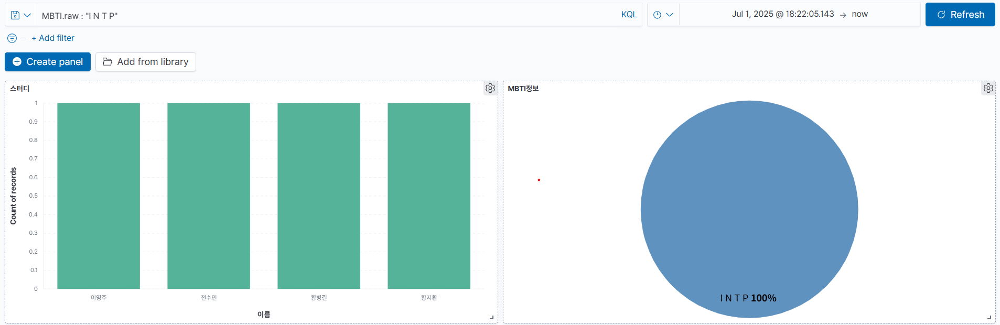
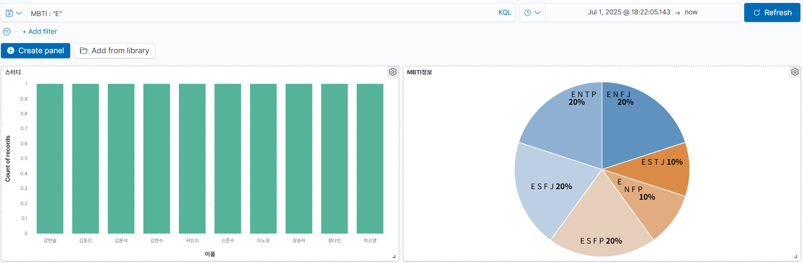
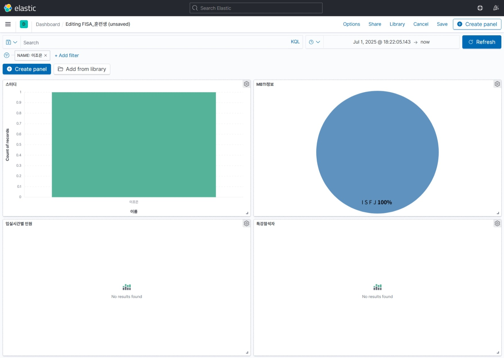
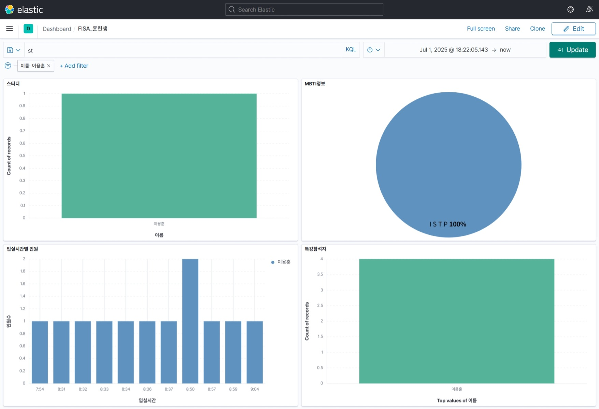
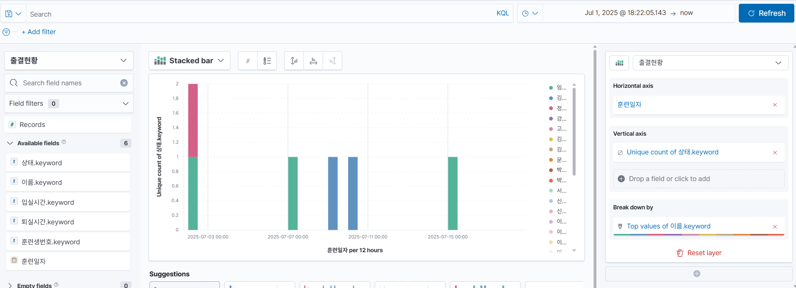

# ELKminiProject
FISA학생들의 스터디 활성화를 위한 데이터분석 미니 프로젝트입니다

## 🔍 ELK 스터디 개요: 출석 및 취향 기반 데이터 분석

### 1. ✅ 스터디 목적

- **ELK 스택의 실습 중심 학습**: 실데이터를 이용해 Elasticsearch, Logstash, Kibana의 연동과 기능을 체험
- 현재 출석데이터를 자동화기능을 사용해서 ELK에 탑재해 분석하는 시스템 개발
- 현재, 비슷한 취향, 취미 등을 가진 친구들을 분석
- 스터디 그룹 활성화를 위한 희망직업 및 희망 스터디 과목 상관관계 분석
- 훗날 모인 데이터를 통해 지각하는 사람들의 특성을 분석하고자 하는 기본 분석시스템 개발

---

### 2. 📊 사용 데이터

- **출석 현황** :  날짜별 출석 여부, 지각/결석 여부
- 훈련생정보 : 기본프로필, MBTI, 싫어하는 것. 좋아하는 것, 희망하는 직업분야,

---

### 3. ⚙️ 기술 스택

- **Filebeats**: 출석현황 CSV파일 변경점 탐지하여 전송
- **Logstash**: 데이터 수집 및 정제
- **Elasticsearch**: 데이터 역색인 저장 및 집계처리
- **Kibana**: 대시보드 구성 및 시각화

---

### 4. 🧠 분석/활용 포인트

- **시간대별 출석인원 시각화**
- **학생별 입실시간 시각화**
- **출석률 순위 및 변화 추이 시각화**
- **요일/시간대별 출석 패턴 분석**
- **학생별 취향 분포 시각화**
- **희망직종과 스터디 상관관계 분석**

---

### ⚠️ 트러블슈팅

#### 1. 토큰화 필요
선호직종 등의 정보가 토큰화 되지 않아, 분석이 용이하지 않았음.

> 토큰화 이전
> 

analyzer를 활용하여 공백을 기준으로 토큰화 하여 검색을 용이하게 만들었다.

```
"JOB": {
    "type": "text",
    "analyzer": "whitespace",
    "fields": {
        "raw": {
            "type": "keyword"
        }
    }
}
```
> 토큰화 이후
> 

#### 2. 인덱스별 필드 이름의 불일치

훈련생 정보 인덱스는 'NAME'이라 정의하며, 출결 현황 및 기초특강 참석자 명단 인덱스는 '이름'이라 정의되어, Kibana에서 시각화 하는데에 불편함이 있었다.



Elasticsearch에서 인덱스 훈련생정보에 필드 alias를 추가하여 해결했다.
```
PUT 훈련생정보/_mapping
{
  "properties":{
    "이름":{
      "type": "alias",
      "path": "NAME"
    }
  }
}
```

---

### 5. 📕 대시보드 구성

- 기본 대시보드 구성
  

- 특정 학생의 모든 정보 확인
  
  
- 나와 비슷한 성향 찾기
  

- 특정 스터디 희망인원 확인
  


---

### 6. 🔄 느낀 점 및 한계

- 작은 데이터셋으로도 ELK의 시각화 효과를 직관적으로 확인 가능
- Kibana의 집계/필터 기능으로 분석 흐름이 쉬움
  
- 지각 및 결석과 같은 상태데이터는 조회가 가능하지만
  
  특정 학생의 출석패턴을 분석하는것은 불가능하다
  
  이는 logstash에서 date형식이 제대로 매핑되지 않아 발생한 문제로 확인된다.

---

### 7. 🔜 다음 단계 제안

- 로그 데이터 등 비정형 데이터도 연동해보기
- Elasticsearch의 k-NN 기능을 이용한 유사도 기반 추천 고도화
